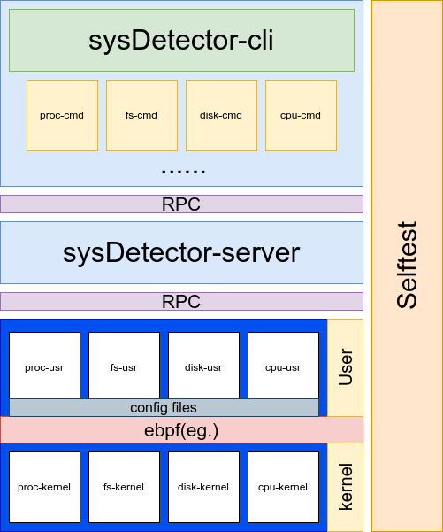

# sysDetector

🌐 [English](./docs/README-EN.md) | 🇨🇳 [中文](./docs/zh/README_ZH.md)

[](./docs/README-EN.md)
[](./docs/zh/README_ZH.md)

> 📌 当前文档版本：v0.1.0 | [查看更新日志](CHANGELOG-zh.md)

Linux 系统监控工具

## 框架

<div align="center">
  
</div>

## 安装指南

首先克隆代码仓库:

```bash
git clone git@github.com:Jvlegod/sysDetector.git
git submodule update --init --recursive  # 初始化并更新子模块
```

编译安装

```bash
# 方法1:
# 需要在 "src/" 目录下执行
mkdir -p tmp && cd tmp
sudo cmake ..
sudo make && sudo make install
# 方法2:
# 需要在 "src/" 目录下执行
sudo python3 install.py
```

## 服务启动

基础服务单元:

```bash
sudo systemctl start sysDetector.service
systemctl status sysDetector.service  # 验证服务状态
```

启动模块单元:

```bash
sudo systemctl start <模块名称>.service
```

## 卸载指南

```bash
# 需要在 "src/" 目录下执行
sudo python3 uninstall.py
```

## 使用说明

### 命令行工具

```bash
# 更详细的文档
sysDetector-cli --help
```

### 模块配置

更详细的使用方法, 你应该浏览各个子模块的文档:

[proc](../../src/sysDetector-ebpf/configs/proc/README.md) [fs](../../src/sysDetector-ebpf/configs/fs/README.md)

日志文件路径：

```bash
/var/log/sysDetector/<模块名称>.log
```

## 关键目录

- `/etc/sysDetector` 存放子模块配置文件的根目录

- `/var/log/sysDetector` 日志存放目录

## 待办事项

- 完善文档体系

- 添加自测试系统

- fs, disk 监控等其他功能扩展...

## 联系

如果您有任何问题, 建议或者反馈, 欢迎联系我.

- Email: ming.jvle@gmail.com